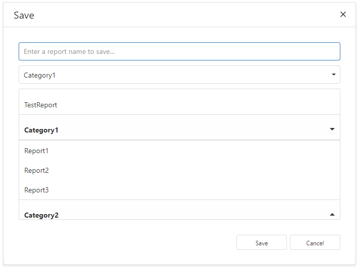
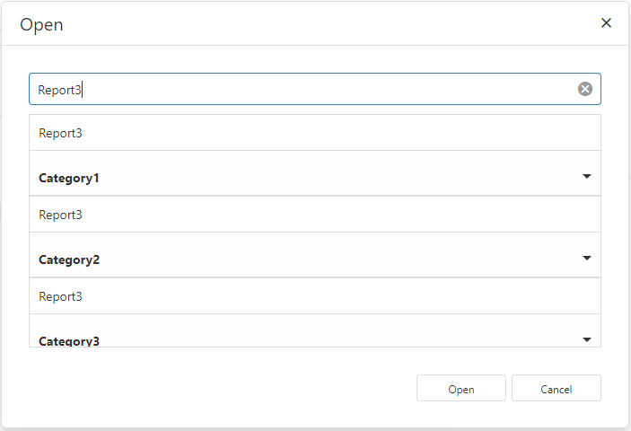

<!-- default badges list -->

<!-- default badges end -->
# How to Customize the Save As and Open Dialogs in the Web End-User Report Designer    

This example demonstrates how to use the End-User Report Designer client-side API to customize the **Save As** and **Open** dialogs. 

* To customize the **Save As** dialog, handle the [CustomizeSaveAsDialog](https://docs.devexpress.com/XtraReports/js-ASPxClientReportDesigner?p=netframework#js_aspxclientreportdesigner_customizesaveasdialog) event and call the [e.Customize](https://docs.devexpress.com/XtraReports/js-ASPxClientReportDesignerCustomizeSaveAsDialogEventArgs#js_aspxclientreportdesignercustomizesaveasdialogeventargs_customize_template_model_) method.

* To customize the **Open** dialog, handle the [CustomizeOpenDialog](https://docs.devexpress.com/XtraReports/js-ASPxClientReportDesigner?p=netframework#js_aspxclientreportdesigner_customizeopendialog) event and call the [e.Customize](https://docs.devexpress.com/XtraReports/js-ASPxClientReportDesignerCustomizeOpenDialogEventArgs#js_aspxclientreportdesignercustomizeopendialogeventargs_customize_template_model_) method.

## Customize the Save As Dialog    

Report files in this example are arranged in folders in the root **Reports** folder. Folder names correspond to the report's _Category_.  The customized dialog displays report names and categories and allows the user to do the following: 

* select the existing category and file name, and save the report  
* enter the category name and create a new category 
* enter the file name and save a report with a new name. 

The dialog also displays reports that do not fall in any category - reports created by the **ReportsFactory** static class and reports in the root Reports folder.   

### Dialog Template    

The **Save As dialog** is defined in a HTML template. The template contains the following widgets: 

* the [TextBox](https://js.devexpress.com/Documentation/Guide/Widgets/TextBox/Overview/) editor is bound to the model's inputValue property and displays the report's name 
* the [SelectBox](https://js.devexpress.com/Documentation/Guide/Widgets/SelectBox/Overview/) editor is bound to the model's categories property and displays the category name 
* the [List](https://js.devexpress.com/Documentation/Guide/Widgets/List/Overview/) widget is bound to the model's categories property and displays reports grouped by category. The categories data is an array of keys (category names) associated with multiple values (report names). The dxListBox  requires this structure to display grouped values. 
  

### Dialog Model   

The dialog model defines the properties used in the dialog template and binds them to Knockout observables. The model specifies the following functions: 

* to set the current report URL 
* to get the current report URL 
* to update the model's properties when the dialog is displayed. The _updateCategories_ JavaScript function is used. 

The _updateCategories_ function calls the client-side [DevExpress.Reporting.Designer.ReportStorageWeb.getUrls](https://docs.devexpress.com/XtraReports/js-ASPxClientReportDesigner?p=netframework#js_aspxclientreportdesigner_reportstoragegeturls) method to obtain report names and categories. This method uses the [ReportStorageWebExtension.GetUrls](https://docs.devexpress.com/XtraReports/DevExpress.XtraReports.Web.Extensions.ReportStorageWebExtension.GetUrls) method of a server-side report storage to get a dictionary that contains report names and categories. The code processes the dictionary and fills the categories data array. 

The model defines the dialog buttons and their actions. The Save button's action calls the [e.Popup.save](https://docs.devexpress.com/XtraReports/js-DevExpress.Reporting.Designer.Tools.SaveAsReportDialog?p=netframework#js_devexpress_reporting_designer_tools_saveasreportdialog_save_url_) method and the Cancel button's action calls the [e.Popup.cancel](https://docs.devexpress.com/XtraReports/js-DevExpress.Reporting.Designer.Tools.ReportDialogBase#js_devexpress_reporting_designer_tools_reportdialogbase_cancel) method. 

The dialog HTML template and dialog model are passed to the [e.Customize](https://docs.devexpress.com/XtraReports/js-ASPxClientReportDesignerCustomizeSaveAsDialogEventArgs#js_aspxclientreportdesignercustomizesaveasdialogeventargs_customize_template_model_) method to modify the Report Designer's Save As dialog. This method is available in the **CustomizeSaveAsDialog** event handler. 

### CustomizeSaveAsDialog event  

The _customizeSaveAsDialog_ function is the [CustomizeSaveAsDialog](https://docs.devexpress.com/XtraReports/js-ASPxClientReportDesigner?p=netframework#js_aspxclientreportdesigner_customizesaveasdialog) event handler. The function uses the event handler argument’s **Popup** property to specify the dialog’s width, height, and title. The function defines variables used in the dialog model and defines the dialog model. Finally, the function calls the **e.Customize** method to modify the dialog based on the specified model and template.  

The [ReportDesignerClientSideEventsBuilder.CustomizeSaveAsDialog](https://docs.devexpress.com/XtraReports/DevExpress.AspNetCore.Reporting.ReportDesigner.ReportDesignerClientSideEventsBuilder.CustomizeSaveAsDialog(System.String)) method is used to set the name of the JavaScript function that handles the **CustomizeSaveAsDialog** event (the _customizeSaveAsDialog_ function in this example).  

## Customize the Open Dialog   

The custom Open dialog allows the user to find a report in a list grouped by category, select the report, and open it. The user can type in the text box to filter the list and find report and category names that contain the input string.

The Open dialog is customized in the same way as the Save As dialog. The [ReportDesignerClientSideEventsBuilder.CustomizeOpenDialog](https://docs.devexpress.com/XtraReports/DevExpress.AspNetCore.Reporting.ReportDesigner.ReportDesignerClientSideEventsBuilder.CustomizeOpenDialog(System.String)) method specifies the name of the JavaScript function that handles the [CustomizeOpenDialog](https://docs.devexpress.com/XtraReports/js-ASPxClientReportDesigner?p=netframework#js_aspxclientreportdesigner_customizeopendialog) event - the _customizeOpenDialog_ function in this example.  

The Open **dialog template** and the **dialog model** are defined and passed to the e.Customize method to modify the dialog.  

 
